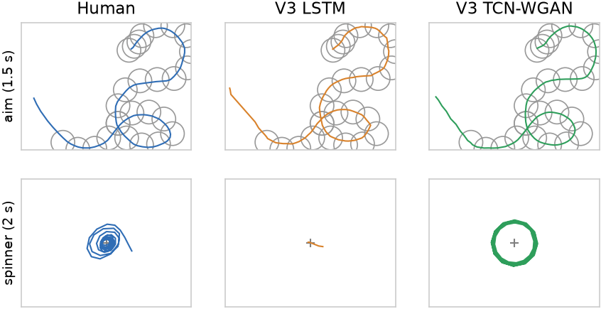
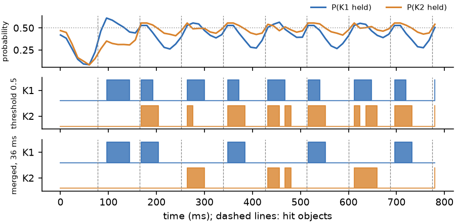

# osu! AI: playing like a human / 像人一样打 osu!

**English** · [中文](#中文说明) · Paper: [English PDF](paper/paper_en.pdf) · [中文 PDF](paper/paper_zh.pdf) · [Experiment log / 实验记录](results/RESULTS.md)

   

Neural networks that learn from top players' replays how to play the rhythm game
[osu!](https://osu.ppy.sh), and play the result back in osu!lazer. The goal is not a perfect
autoplayer but play that *looks human*: smooth, imperfect cursor paths, real spinning and
natural key timing.



*On a map no model has seen, the LSTM aims as well as the GAN but sits still on spinners
(bottom row). The TCN-WGAN spins like the human.*

## Results

Trained on 1,992 replays from over 1,000 players, tested on 50 maps no model trained on:

| | Relax accuracy (cursor only) | Full accuracy (cursor + keys) | Spinner speed |
|---|---|---|---|
| Human replays | 99.98% | 96.04% | 371 RPM |
| LSTM baseline | 99.92% | 96.28% | 3 RPM |
| **TCN-WGAN** | **99.89%** | **96.01%** | **394 RPM** |

Both cursor models aim almost perfectly, so full accuracy is limited by the key model they
share. The LSTM aims slightly more precisely but outputs the average path and never spins;
the TCN-WGAN samples human-like paths. Full accuracy uses press merging (see below); without
it the TCN-WGAN scores 93.55%.

In osu!lazer, logged out:

| Map | Stars | Mods | Accuracy | 300 / 100 / 50 / miss |
|---|---|---|---|---|
| KAZMASA - Bon Appetit S [blend s (260 bpm)] | 6.86 | HD HR, Relax (cursor only) | **99.95%**, full combo | 1647 / 1 / 0 / 0 |
| Kenshi Yonezu - IRIS OUT [Darling!!!] | 7.11 | HD HR | **96.63%** | 654 / 28 / 0 / 5 |
| Ado - AiAiA [Kiss me Insane] | 4.07 | | 98.38% | 668 / 12 / 2 / 3 |
| Ado - AiAiA [Be loved Expert] | 5.70 | | 95.85% | 820 / 39 / 15 / 3 |

On IRIS OUT the hit timing had a standard deviation of 8.1 ms (UR 81).

## Quick start

You need Windows, an NVIDIA GPU, [uv](https://docs.astral.sh/uv/), osu!lazer and
[tosu](https://github.com/tosuapp/tosu). The trained models are included.

```bash
uv sync
uv run python -m osuai.play
```

1. Start tosu (set `POLL_RATE=10` in its config), **log out** of osu!lazer and turn off
   "High precision mouse".
2. Pick a map in the game; the window generates a play for it.
3. Press **Q** to start, **W** to stop, **R** to release the keys. Tick "Cursor only" and
   turn on Relax in the game to let the game press the keys.

Playback only runs while nobody is logged in.

## What this project found

Most of the gains came from fixing training objectives and evaluation, not from new
architectures. The paper explains each finding from first principles:

1. **The GAN critic never learned.** A finite-difference gradient penalty measures the
   gradient along one random direction, which in a 4,096-dimensional trajectory is about
   1/64 of its size. The exact penalty on a convolutional critic fixed it.
2. **The GAN could not aim** because its learning rate was too low. Pretraining the
   generator at a higher rate took Relax accuracy from 56.5% to 96.7%.
3. **Regression models cannot spin.** They learn the average path, and the average of every
   player's spinner circle is the centre. A separate polar output for spinners and a loss on
   spin speed and radius made the GAN spin.
4. **The evaluation used half the real circle radius.** After fixing it, offline predictions
   match the game within about one percentage point.
5. **Double key presses lose accuracy in game.** The key model often presses both keys at
   once; the extra press hits the next note early or steals a slider head. Merging presses
   closer than 36 ms, or 0.4 times the note spacing in fast streams, fixed most of it.



## How it works

```
.osu map ──► features (12 ms frames) ──► TCN-WGAN generator + noise ──► cursor path
                                     └─► key LSTM ──► press merging ──► key presses
                                                                            │
osu!lazer ◄── mouse and keyboard ◄── player loop ◄── song time from tosu ◄──┘
```

| Module | What it does |
|---|---|
| `osuai/beatmap.py`, `slider_path.py` | Read .osu files, slider curves, mods (HR, DT, HT, EZ) |
| `osuai/replay.py` | Read .osr replays |
| `osuai/features.py` | Map features and replay targets on the 12 ms frame timeline |
| `osuai/models.py`, `train.py` | TCN-WGAN, LSTM baseline and key model; training |
| `osuai/decoding.py` | Press merging |
| `osuai/judge.py`, `evaluate.py` | Scoring plays the way the game does, for models and humans |
| `osuai/dataset.py`, `sources/` | Building the training set, importing replays and maps |
| `osuai/play/` | osu!lazer playback through tosu |

## Training and evaluation

Data goes in `data/` (replays, maps and music are not included in this repository).

```bash
# get data: the osu!3k dataset (your own Kaggle token) or a player's replays
# (your own OSU_SESSION cookie in .env, which git ignores)
uv run --extra osu3k python -m osuai.sources.osu3k --count 1000
uv run python -m osuai.sources.osu_web --user 7562902

# build the training set, train, evaluate
uv run python -m osuai.dataset --name v4
uv run python -m osuai.train cursor --data v4 --out models/v4 --epochs 90 --pretrain 60
uv run python -m osuai.train keys --data v4 --out models/v4 --epochs 30
uv run python -m osuai.evaluate --split test --gaps none 36@0.4
```

## Status and next steps

- The cursor model is close to perfect (99.95% with Relax in game).
- **The key model is the weak point.** It predicts, for each frame, whether a key is held,
  so the exact press moment matters little to its loss. On a 260 BPM HD HR map it still
  failed in game without Relax. Next step: a key model that predicts press events with a
  sub-frame offset, a release tied to the end of the object, and the generated cursor as input.
- Measure human-likeness directly (speed and jerk distributions, a classifier test), not
  only accuracy.

## Responsible use

This is a research project about imitating human behaviour. All in-game testing was done
logged out, so no score was ever submitted online. Using generated play on an online account
breaks the osu! rules and is unfair to other players, and it gets accounts banned. The
playback has no anti-detection features.

## Background and credits

The idea and the model families (LSTM, VAE, WGAN, TCN-WGAN) come from
[niooii/osu](https://github.com/niooii/osu), itself inspired by
[OsuLearn](https://github.com/GuiBrandt/OsuLearn). This project's first version was built on
niooii's code and trained the V3 models; all code in this repository was then written from
scratch, and the V3 models were converted to it with identical outputs. Data: the
[osu!3k](https://www.kaggle.com/datasets/ilymeow/osu3k) dataset (MIT licence). Playback:
[tosu](https://github.com/tosuapp/tosu) and [osu!lazer](https://github.com/ppy/osu). The code,
experiments and paper were developed with Claude (Anthropic) as a coding assistant.

## Citation

```bibtex
@misc{pekin2026osuai,
  author       = {pekin},
  title        = {Playing osu! Like a Human: Cursor Generation with a TCN-WGAN and Key Press Decoding},
  year         = {2026},
  howpublished = {\url{https://github.com/pekingfather15/osuai}}
}
```

---

## 中文说明

[English](#osu-ai-playing-like-a-human--像人一样打-osu) · **中文**

用顶尖玩家的回放训练神经网络，学习怎么玩节奏游戏 [osu!](https://osu.ppy.sh)，再在 osu!lazer 里回放。
目标不是做一个完美的自动打图程序，而是让它打得**像人**：光标轨迹平滑但不完美，会真正地转转盘，按键节奏自然。

### 结果

用 1,000 多名玩家的 1,992 份回放训练，在 50 张从未参与训练的谱面上测试：

| | Relax 准确率（只看光标） | 完整准确率（光标 + 按键） | 转盘转速 |
|---|---|---|---|
| 真人回放 | 99.98% | 96.04% | 371 RPM |
| LSTM 基线 | 99.92% | 96.28% | 3 RPM |
| **TCN-WGAN** | **99.89%** | **96.01%** | **394 RPM** |

两个光标模型都几乎瞄得完美，完整准确率卡在它们共用的按键模型上。LSTM 瞄得略准，但它输出的是平均轨迹，从不转盘；
TCN-WGAN 能采样出像人的轨迹。完整准确率使用了按键合并（见下文），不合并时 TCN-WGAN 为 93.55%。

osu!lazer 实战（未登录状态）：

| 谱面 | 星级 | 模组 | 准确率 | 300 / 100 / 50 / Miss |
|---|---|---|---|---|
| KAZMASA - Bon Appetit S [blend s (260 bpm)] | 6.86 | HD HR，Relax（只用光标） | **99.95%**，全连 | 1647 / 1 / 0 / 0 |
| 米津玄師 - IRIS OUT [Darling!!!] | 7.11 | HD HR | **96.63%** | 654 / 28 / 0 / 5 |
| Ado - AiAiA [Kiss me Insane] | 4.07 | | 98.38% | 668 / 12 / 2 / 3 |
| Ado - AiAiA [Be loved Expert] | 5.70 | | 95.85% | 820 / 39 / 15 / 3 |

IRIS OUT 那局按键时间的标准差为 8.1 ms（UR 81）。

### 快速开始

需要 Windows、NVIDIA 显卡、[uv](https://docs.astral.sh/uv/)、osu!lazer 和 [tosu](https://github.com/tosuapp/tosu)。训练好的模型已包含在仓库里。

```bash
uv sync
uv run python -m osuai.play
```

1. 启动 tosu（在它的配置里设 `POLL_RATE=10`），**退出 osu!lazer 的登录**，关闭"高精度鼠标"。
2. 在游戏里选好谱面，窗口会自动为它生成一局。
3. 按 **Q** 开始，**W** 停止，**R** 松开按键。勾选 "Cursor only" 并在游戏里开 Relax，就由游戏负责按键。

只有在未登录状态下才会回放。

### 主要发现

提升大多来自修正训练目标和评估方法，而不是换新的模型结构。论文从原理上解释了每一条：

1. **GAN 的判别器根本没学会。** 有限差分梯度惩罚只沿一个随机方向测梯度，在 4,096 维的轨迹里只测到约 1/64。改用卷积判别器上的标准梯度惩罚后解决。
2. **GAN 瞄不准**，因为学习率太低。先用更高的学习率预训练生成器，Relax 准确率从 56.5% 升到 96.7%。
3. **回归模型不会转盘。** 它学到的是平均轨迹，而所有玩家转盘画的圆平均起来就是圆心。为转盘单独设计极坐标输出，再加上约束转速和半径的损失，GAN 就会转了。
4. **原评估用的圆圈半径只有实际的一半。** 修正后，离线预测和实战结果相差约一个百分点。
5. **重复按键让实战掉分。** 按键模型常常两个键一起按，多出的按键会提前打到下一个物件，或者抢走滑条头。把间隔小于 36 ms（快速连打中为音符间隔的 0.4 倍）的按下合并后，大部分问题都解决了。

### 工作原理

```
.osu 谱面 ──► 特征（12 ms 一帧）──► TCN-WGAN 生成器 + 噪声 ──► 光标轨迹
                               └─► 按键 LSTM ──► 合并按键 ──► 按键
                                                                │
osu!lazer ◄── 鼠标和键盘 ◄── 回放循环 ◄── tosu 提供的歌曲时间 ◄──┘
```

| 模块 | 作用 |
|---|---|
| `osuai/beatmap.py`、`slider_path.py` | 读取 .osu 文件、滑条曲线、模组（HR、DT、HT、EZ） |
| `osuai/replay.py` | 读取 .osr 回放 |
| `osuai/features.py` | 12 ms 时间轴上的谱面特征和回放目标 |
| `osuai/models.py`、`train.py` | TCN-WGAN、LSTM 基线和按键模型；训练 |
| `osuai/decoding.py` | 按键合并 |
| `osuai/judge.py`、`evaluate.py` | 按游戏规则给模型和真人评分 |
| `osuai/dataset.py`、`sources/` | 生成训练集，导入回放和谱面 |
| `osuai/play/` | 通过 tosu 在 osu!lazer 中回放 |

### 训练和评估

数据放在 `data/` 里（本仓库不包含回放、谱面和音乐）。命令见上方英文部分的 [Training and evaluation](#training-and-evaluation)。
获取数据需要你自己的 Kaggle 令牌，或者在 `.env` 里写入你自己的 `OSU_SESSION` cookie（git 会忽略这个文件）。

### 现状和下一步

- 光标模型已接近完美（实战开 Relax 打出 99.95%）。
- **按键模型是短板。** 它逐帧预测按键是否按住，损失函数对准确的按下时刻不敏感。在一张 260 BPM、开 HD HR 的谱面上，不开 Relax 仍会失败。
  下一步：训练直接预测按下事件的按键模型，包括帧内偏移、与物件结束时刻绑定的松开时间，并以生成的光标轨迹作为输入。
- 直接衡量"像人"的程度（速度、加加速度的分布，分类器测试），而不只看准确率。

### 使用须知

这是一个研究如何模仿人类行为的项目。所有游戏内测试都在未登录状态下进行，没有任何成绩被提交到线上。
在线上账号中使用生成的游玩违反 osu! 规则，对其他玩家不公平，也会导致封号。回放程序不包含任何反检测功能。

### 背景与致谢

项目的想法和几类模型（LSTM、VAE、WGAN、TCN-WGAN）来自 [niooii/osu](https://github.com/niooii/osu)，该项目又受到
[OsuLearn](https://github.com/GuiBrandt/OsuLearn) 的启发。本项目的第一版建立在 niooii 的代码之上，并用它训练了 V3 模型；
之后本仓库的所有代码都从头重写，V3 模型已转换到新代码，输出完全相同。数据：[osu!3k](https://www.kaggle.com/datasets/ilymeow/osu3k) 数据集（MIT 许可）。
回放：[tosu](https://github.com/tosuapp/tosu) 和 [osu!lazer](https://github.com/ppy/osu)。代码、实验和论文在编写过程中使用了 Claude（Anthropic）作为编程助手。

引用方式见上方 [Citation](#citation)。
